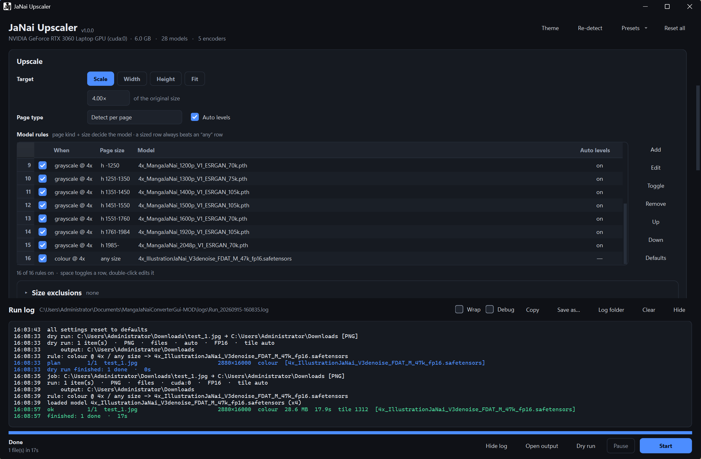

# JaNai Upscaler

A desktop application for upscaling manga, comics and illustrations with
spandrel-compatible super-resolution models. Point it at images, folders or
comic archives; it picks the right model per page, upscales on your GPU, and
writes loose images or ready-to-read CBZ files.

This is a fork of [the-database/MangaJaNaiConverterGui](https://github.com/the-database/MangaJaNaiConverterGui).
The upscaling backend is still that project's chaiNNer-derived code; the
application around it has been rewritten in Python.



---

## 1. What this fork adds

### A single-language application

| | Upstream | This fork |
| --- | --- | --- |
| Application | Avalonia / C# desktop app driving a Python worker | Python + PySide6 (Qt) throughout |
| GUI ↔ worker wire format | prefixed stdout lines (`PROGRESS=…`, `TOTALZIP=…`) | JSON Lines, one event object per line |
| Platforms | Windows | Windows and Linux |
| Headless use | — | a full command-line driver |
| Build requirement | .NET SDK | none beyond Python and `uv` |

One language means one settings format, one wire protocol and one toolchain.
The C# project, its XAML views and its packaging scripts were removed rather
than kept alongside the new UI.

### Features this fork adds

* **A rules table that chooses the model.** Each row matches on page traits
  (grayscale vs colour, size) and names the model to use, so a folder of mixed
  pages is handled in one run without switching settings by hand. The table is
  the only thing that selects a model — there is no second, hidden mechanism.
* **Fit modes and device presets.** Upscale by scale factor, to a target width,
  to a target height, or to fit a specific screen size.
* **Adaptive tiling from measurement.** The machine is profiled once, then tile
  size is chosen from that measurement and held across a chapter instead of
  being re-guessed per image. A fixed tile size and a VRAM budget are still
  available.
* **A capability probe at startup.** Devices, encoders, models and library
  versions are detected and reported, so the format list offers only what this
  install can actually write, with a tooltip explaining anything that is off.
* **Output packaging.** Loose files, one CBZ per source folder or archive, or a
  single CBZ for the whole run.
* **Dry run.** Reports exactly what a run would write — including skips and
  exclusions — without loading a model.
* **Resume.** A `.janai-resume.json` manifest is written next to the output and
  keyed by source path, so a run cancelled in the middle of file 11 of 100
  resumes inside file 11, not at file 1. Archives are tracked at page level, not
  just as whole files. The manifest is fingerprinted over the settings that
  change the output, so changing thread counts does not invalidate finished work
  but changing the format does.
* **A headless driver.** `janai run | plan | probe | where` with `--json`,
  `--print-job`, `--cancel-after`, `--resume/--no-resume` and meaningful exit
  codes, so the pipeline can be scripted or tested without the GUI and without
  hand-writing a job file.
* **Named presets, a live run log** (kept on disk, 40 runs), **a keep-GPU-awake
  hold**, dark/light theme, and a status line with one monotonic counter.
* **Linux support** — `setup.sh` and `./janai-upscaler.sh` alongside the Windows
  `setup.cmd` / `JaNaiUpscaler.cmd`.
* **A self-contained install.** The interpreter, weights, backend source, ICC
  profiles and tools are all resolved inside the app folder. It never reads from
  an install of the original application.

### Engineering work

* The worker and the main window were split into cohesive modules
  (`worker.py` 3,264 → 168 lines; `window.py` 2,764 → 811 lines) with a one-way
  dependency direction: `app → core`, `worker → core`, and nothing imports
  `app`. Nothing under `app` or `core` imports torch, which is what keeps the
  window and the dry run instant.
* ruff (lint + format) and mypy run with committed configuration, in CI on
  Windows and Ubuntu, plus ~20 executable gate scripts and a real-GPU self-test.
* ~40 defects found and fixed in this fork's own code across concurrency,
  cancellation, archive handling, path handling and output naming.
* Two defects in the inherited chaiNNer-derived backend were fixed after reading
  the code at the fork point directly. Both are now covered by a test in this
  repository:
  * the tile-size budget was computed from the card's **total** VRAM while
    `mem_get_info()`'s free-memory value was discarded, so tiles could be
    planned larger than the memory actually available; it is now budgeted from
    free memory;
  * the out-of-memory recovery path copied the failing tile back to host RAM
    (and discarded the copy) inside an `except Exception: pass`, asking for a
    large host allocation at the moment an allocation had just failed; recovery
    now simply releases the device allocation. The adjacent pause path called
    `safe_cuda_cache_empty()`, a name that module neither defines nor imports,
    and now calls the imported device-aware function.

  These statements describe the code as it stood at the commit this fork
  branched from and may not reflect current upstream.
* Dependency pins were audited by measurement rather than by changelog. One
  available upgrade (libvips 8.18.6) was **rejected** because it changes PNG and
  AVIF output bytes for identical inputs and settings; the reason is recorded on
  the pin itself.

Full detail, with commit references: [`docs/changes.md`](docs/changes.md).

---

## 2. Using JaNai Upscaler

### Requirements

* Windows 10/11 or Linux
* An NVIDIA GPU is strongly recommended (CPU upscaling works, but is slow)
* [`uv`](https://docs.astral.sh/uv/) — `setup` installs it if it is missing
* ~10 GB of disk space for the runtime, torch build and model packs

### Setup

Clone or download the repository, then run the installer once:

```bat
setup.cmd
```

```bash
./setup.sh
```

It builds a private Python environment under `backend\python`, installs the
torch build that matches your CUDA runtime, downloads the model packs into
`backend\models`, and fetches the JPEG XL tools. It is safe to re-run.

| Option | Effect |
| --- | --- |
| `-Python 3.12` | build the environment on a different Python version |
| `-Torch cpu` \| `cu126` \| `cu128` \| `cu129` | override the auto-detected torch build |
| `-Models manga` \| `illustration` \| `none` | fetch only some model packs |
| `-JxlTools <dir>` | take `cjxl`/`djxl` from a specific folder |
| `-NoJxlPlugin` | skip `pillow-jxl-plugin` |
| `-Offline` | fail rather than download anything |
| `-Force` | redo every step and overwrite what is there |

The Linux script takes the same options in `--flag` form.

### Running

```bat
JaNaiUpscaler.cmd
```

```bash
./janai-upscaler.sh
```

The launcher finds the interpreter recorded in `janai.runtime.txt` and starts
the GUI. If setup has not run, the window still opens — but upscaling needs the
private environment.

### The interface

**Input.** Choose one or more image files, a folder, or a comic archive
(`.cbz`, `.zip`, `.cbr`, `.rar`, `.cb7`, `.7z`). Folders are walked
recursively, and archives are walked page by page. A pre-run scan reports how
many pages were found.

**Upscale.** Pick a mode — *Scale*, *Width*, *Height* or *Fit* (with presets
for common screen sizes) — and a device. *Auto* always prefers a GPU.

**Rules.** The rules table decides which model handles which page. Rows are
evaluated in order; the first match wins. Grayscale detection is measured per
page, so a colour cover inside a grayscale chapter still gets the colour model.

**Output.** Choose a destination folder, an output format, and how results are
packaged:

| Package mode | Result |
| --- | --- |
| `Files` | loose images, mirroring the input layout |
| `CBZ per folder` | one `.cbz` per source folder or archive — point it at a series whose chapters are separate folders and each chapter comes out as its own CBZ |
| `One CBZ` | the whole run collected into a single `.cbz` |

The format list is built from a real capability probe, so only encoders this
install can use are offered.

**Performance.** FP16 (on by default, capability-checked), tile size
(*Auto (adaptive)* or a fixed value), VRAM budget, and worker counts for
decoding and encoding. *Keep GPU awake* holds a context open between runs so a
long session does not pay repeated warm-up costs.

**Dry run** answers "what would this actually do?" without loading a model —
useful for checking exclusions, naming and skip behaviour before committing to a
long run.

**Resume.** If a run is cancelled or interrupted, starting the same job again
skips everything already finished, including pages already converted inside a
half-processed archive.

### Shortcuts

| Key | Action |
| --- | --- |
| `Ctrl+O` / `Ctrl+Shift+O` | choose file / choose folder |
| `Ctrl+Enter` | start |
| `Ctrl+Shift+Enter` | dry run |
| `Esc` | cancel |
| `Ctrl+L` | show/hide the log |
| `Ctrl+D` | dark/light theme |
| `F5` | re-detect devices, encoders and models |

### Files the app writes

| File | Purpose |
| --- | --- |
| `settings.json` | current UI state |
| `presets\<name>.janai.json` | named presets |
| `janai.config.json`, `janai.runtime.txt` | install layout and the interpreter setup found |
| `logs\Run_YYYYMMDD-HHMMSS.log` | one log per run (40 kept) |
| `<output>\.janai-resume.json` | resume manifest for the destination |

### Command line

The application can be driven without the GUI — for scripting batches, for CI,
or for testing a change without clicking through the interface:

```bat
set PY=backend\python\Scripts\python.exe

%PY% -m janai probe --json              :: devices, encoders, models, versions
%PY% -m janai plan -i input -o output   :: what a run would do, nothing written
%PY% -m janai run  -i input -o output   :: run it
%PY% -m janai run  -i input -o output --no-resume
%PY% -m janai where                     :: resolved install paths
```

Exit codes are `0` success, `1` the job failed, `2` bad usage, `130` cancelled.
`--print-job` dumps the job document the GUI would have written, `--json`
switches output to machine-readable events, and `--cancel-after SECONDS` is
there to exercise the cancel and resume paths deterministically.

The worker itself is also usable directly, which is the lowest-level way in:

```bat
%PY% src\janai\worker\worker.py --probe
%PY% src\janai\worker\worker.py --job job.json
%PY% src\janai\worker\worker.py --job job.json --dry-run
%PY% src\janai\worker\worker.py --hold --device cuda:0
```

`--job` takes the same JSON the GUI writes (`input`, `output`, `format`,
`upscale`, `perf` sections) and streams JSON Lines progress events on stdout;
send `cancel`, `pause` or `resume` on stdin to control it.

A `uv` environment keeps the interpreter in `Scripts\`, an embedded runtime is
flat, and on Linux it is `backend/python/bin/python`. `janai.runtime.txt`
records whichever one setup found.

### Development

The code is a plain `src`-layout package:

```
src/janai/app      Qt interface
src/janai/core     shared, torch-free logic
src/janai/worker   the upscaling subprocess
scripts/           executable checks and harnesses
backend/src/       vendored chaiNNer-derived inference backend
```

Formatting and linting use [ruff](https://docs.astral.sh/ruff/); types are
checked with [mypy](https://mypy-lang.org/). Both are pinned and run through
`uvx`, so neither is ever installed into the shipped environment:

```
uvx ruff@0.16.7 format --check .
uvx ruff@0.16.7 check .
uvx mypy@2.3.1
```

Verification runs on the private interpreter, not a system Python:

```
%PY% -m compileall -q src scripts backend\src
%PY% scripts\smoke.py             :: dependency-free assertions about the tree
%PY% scripts\plannercheck.py      :: tile planner
%PY% scripts\uicheck.py           :: the window, offscreen
%PY% scripts\selftest.py          :: whole pipeline on a real GPU, prints ALL PASS
%PY% scripts\bench.py --input page.png --tiles auto,1024,768
```

`scripts\` also holds focused gates for archives, output naming, counters, the
write pool, bundles, long Windows paths and stdin handling; CI runs the
dependency-free ones on Windows and Ubuntu, and type-checks with
`mypy --platform win32`.

`AGENTS.md` documents the architecture, the invariants that must not be broken,
and the exact verification commands. Contributions should keep
behaviour-preserving moves in separate commits from behaviour changes.

### Troubleshooting

* **"Portable runtime not found"** — setup has not run yet. The GUI opens with
  the system Python, but upscaling needs `backend\python`.
* **No models listed** — drop `.pth`/`.safetensors` files into `backend\models`
  and press `F5`, or re-run `setup.cmd -Models all`.
* **JXL disabled** — the tooltip explains why. Putting `cjxl` in
  `backend\tools\` fixes it; setup also tries `pillow-jxl-plugin`.
* **GPU not listed** — the CPU torch build got installed; re-run
  `setup.cmd -Torch cu128 -Force`. If CUDA is present but the run still uses the
  CPU, check the device selector is not pinned to CPU. The first log line of
  every run states the device actually used.
* **`.cbr` / `.rar` input** — needs `unrar` or `7z` available; the probe reports
  whether one was found.
* **Out of memory** — *Auto (adaptive)* backs off after real pressure and says so
  in the log. If a run still dies, set a fixed tile size or a VRAM budget in
  Performance. Other GPU applications reduce the free memory the planner has to
  work with.
* **`torch.meshgrid: ... indexing argument` warning** — harmless, and filtered:
  it comes from inside torch's own code, not from this app or the models.
* **spandrel and `uv`** — `backend\python` carries stock `spandrel` 0.4.1 from
  PyPI, so `uv pip install` cannot break it. FDAT support lives separately in
  `backend\src\spandrel_custom\` and registers the extra architectures at
  runtime. Keep that folder: FDAT models do not load without it.

### Credits and license

The upscaling backend, the model packs and the original application are the work
of [the-database](https://github.com/the-database) and the
[chaiNNer](https://github.com/chaiNNer-org/chaiNNer) project. This fork keeps
that backend and rewrites the application around it. See `LICENSE` for terms;
the vendored backend remains under its original GPL licensing.
